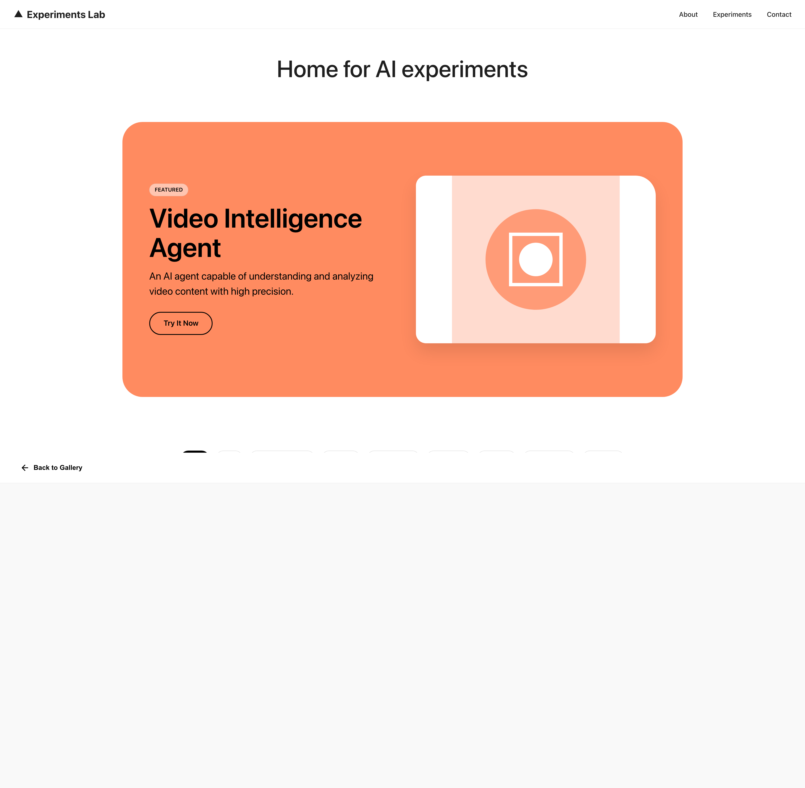
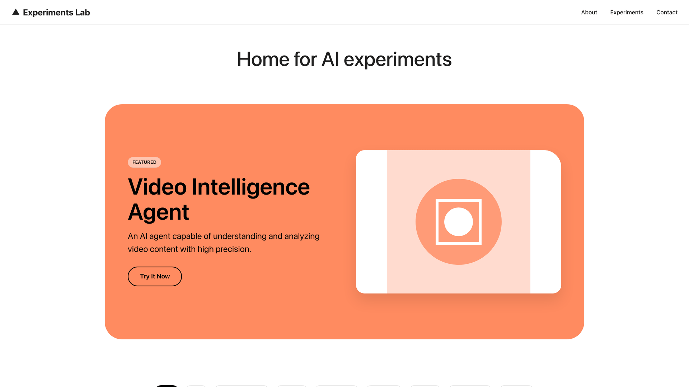
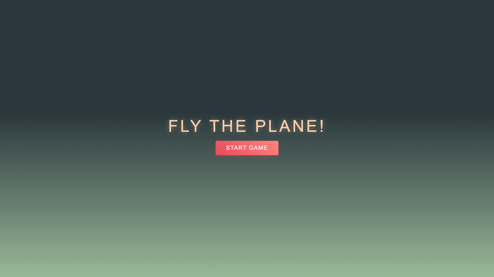
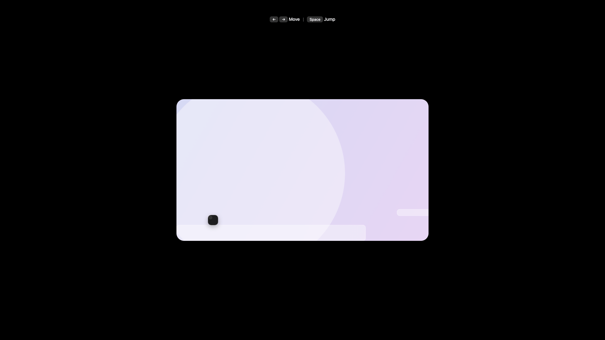

# My Experiments Lab

A modern, interactive gallery for AI and creative coding experiments. Built with Vite and vanilla JavaScript, this project showcases various web-based experiments and interactive demos.

## Overview

My Experiments Lab is a portfolio-style web application that features:
- **Featured Project Showcase** - Highlight your best experiment
- **Dynamic Experiments Grid** - Browse through all your projects
- **Filter System** - Organize experiments by categories/tags
- **Project Viewer** - Embedded iframe viewer for instant demos
- **Responsive Design** - Works seamlessly across devices

## Screenshots & Demo

### Main Gallery View

*The home page showcasing the featured experiment and dynamic grid of all projects*

### Interactive Project Viewer

*Click any project card to view it in the embedded iframe viewer - no page reloads needed!*

### Filter & Browse Experience

*Seamlessly filter experiments by tags and categories*

### Sample Experiments

#### Dragon Flight Game

*Navigate through obstacles in this engaging flight simulator*

#### Platformer Game

*Classic platformer mechanics with smooth controls*

> **Note**: Visit [http://localhost:5173](http://localhost:5173) after running `npm run dev` to see the full experience!

## Features

- 🎨 Modern, clean UI with smooth animations
- 🔍 Filter and search functionality
- 📱 Fully responsive design
- ⚡ Fast development with Vite
- 🧪 Built-in testing with Vitest
- 🎮 Includes sample projects (dragon-flight game, platformer)

## Tech Stack

- **Vite** - Lightning-fast build tool and dev server
- **JavaScript (ES6+)** - Modern vanilla JavaScript
- **CSS3** - Custom styling with CSS variables
- **Vitest** - Unit testing framework
- **jsdom** - DOM testing environment

## Getting Started

### Prerequisites

- Node.js (v14 or higher)
- npm or yarn

### Installation

```bash
# Clone the repository
git clone https://github.com/sarthakh330/my-experiments-lab.git

# Navigate to project directory
cd my-experiments-lab

# Install dependencies
npm install
```

### Development

```bash
# Start ALL servers (dashboard + video-intelligence-agent)
npm run dev:all

# Or just the dashboard
npm run dev
```

- Dashboard opens at `http://localhost:5173`
- Video Intelligence Agent runs at `http://localhost:3000` (when using dev:all)

### Build

```bash
# Create production build
npm run build
```

### Testing

```bash
# Run tests
npm test
```

## Project Structure

```
my-experiments-lab/
├── src/
│   ├── main.js          # Main application logic with error handling
│   ├── data.js          # Projects data and configuration
│   ├── style.css        # Application styles
│   ├── particles.js     # Particle background effects
│   └── *.test.js        # Unit tests
├── public/
│   ├── experiments/     # All experiments live here (monorepo)
│   │   ├── dragon-flight/           # Dragon flight game
│   │   ├── platformer/              # Platformer game
│   │   ├── particle-background/    # GPU particle demo
│   │   └── video-intelligence-agent/ # Video AI agent
│   ├── placeholder.html # Placeholder template
│   └── vite.svg         # Assets
├── index.html           # Main HTML entry point
├── package.json         # Project dependencies
└── .gitignore          # Git ignore rules
```

## Adding New Experiments

1. Add your experiment files to the `public/experiments/your-experiment-name/` directory
2. Update `src/data.js` with your project information:

```javascript
{
  id: 'your-project-id',
  title: 'Your Project Title',
  description: 'Brief description',
  tags: ['tag1', 'tag2'],
  link: '/experiments/your-experiment-name/',
  colorTheme: 'theme-color',
  featured: false,
  external: false, // false = opens in viewer, true = opens in new tab
  visual: '<!-- Your SVG or HTML visual -->'
}
```

3. Run `npm run dev` - No separate servers needed! Everything runs on one port (5173)

## Contributing

Feel free to fork this project and add your own experiments! Pull requests are welcome.

## License

MIT License - Feel free to use this project for your own experiments and learning.

## Author

Built with ⚡ by Sarthak Handa

---

**Note**: This is a living laboratory for web experiments. Expect frequent updates and new additions!
